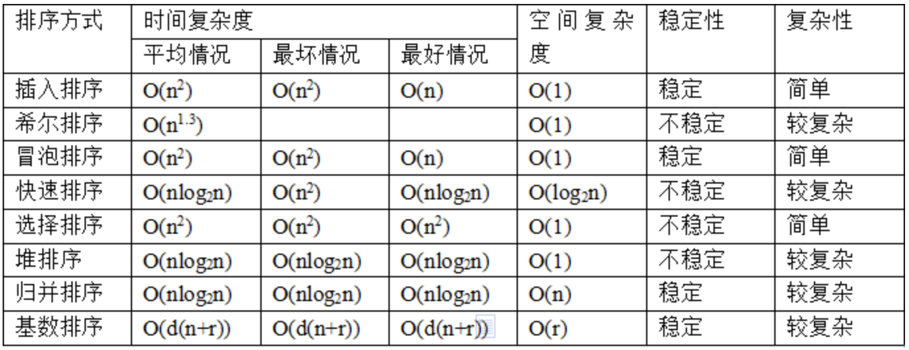

# 0 总述

-  下面排序方法的代码默认都是实现了从小到大的升序排列

-  各种算法的时间以及空间复杂度比较

   

   ---
   
# 1 插入排序

- 分析：就像打扑克一样，按照顺序摸牌是乱序的，而每摸起来一张，就把它插入到自己的手牌中，每一步的插入都能保证手里的牌是有序的，摸牌结束后手里的牌整体有序，这就是插入排序
- 思路：对于一个无序的数组，我们从下标为1的数开始往前面扫描插入，如果前面的数比这个数大就往后面移动一位，直到我们扫描到一个数比这个数小了，或者我们扫描到首位都被移动了，说明我们已经找到这个数该呆的位置了，就把这个数插入到当前位置。这样可以保证每次插入之后，该下标及之前的子数组是有序的。
- 注意点：

  1. i从1开始，因为第一个数字（第一张牌）不涉及到插入或者不插入，故i=0的情况就不予讨论
  2. value找到位置后需要跳出循环不然就会影响到之前的排序

```java
public static void insertSort(int[] nums){
    for(int i = 1; i < nums.length; i++){
        //存储当前要挪动的值，以便腾出空位给比他大的值往后移动
        int temp = nums[i];
        int j = i - 1;
        while(j >= 0 && nums[j] > temp){
            nums[j + 1] = nums[j];
            j--;
        }
        //把temp放在空位上
        nums[j + 1] = temp;
    }
}
```

---

# 2 希尔排序

- 分析：直接插入排序时，由于数据的随机分布，所以一般情况下一个数要找到自己的位置都要移动很多别的数据，而被移动了的数据在给下一个数找正确位置的时候又很可能需要被移动，这样会导致复杂度很高。希尔排序是插入排序的改良版，不断分组使其基本有序（小的基本在前面，大的基本在后面，不大不小的基本在中间），到最后一次分组排序结束后就是完全有序的了，其实本质上是对插入排序的一种优化。
- 思路：一开始的时候，设置一个很大的数作为初始增量（所谓增量就是每一个小组内部两个数之间的距离，一般初始增量设置为数组长度的一半）。这样设置的情况下，一个无序数组会被分成“数组的长度除以2”个小组，每一个小组只有2个数据或者3个数据。（比如数组长度为11，初始增量则可以设置为5，第一组就是index = 0、5、10，第二组是index = 1、6，第三组是2、7，第四组是3、8，第五组是4，9），这种小组数据量很少，保证了使用插入排序的时候就算数据分布的很不利，也不需要移动太多次。而这一次操作之后，可以保证每一个小组都是各自有序的，而每一个小组都是横跨了半个数组，可以一下子把基本上比较大的数通过移动很少的数据量就移到后面（比如index为0的数就是3个数里面最小的，index为10的数就是三个数里面最大的）。然后我们缩小增量再进行分组，小组的数量会减小，每个小组内部的数据会变多，但是这个时候已经有前面分组移动的基础了，这个体量更大的小组相对来说会更加有序一点，所以移动的次数相对也会少。到最后增量缩小到1，也就只剩下整个数组这一个小组了，这个时候就从基本有序，最后一次直接排序变成完全有序了。
- 注意点：分组之后的插入排序，不是每一组插入排序完后再进行下一组的插入排序，而是扫描整个数组，像是CPU中时间片轮转的概念，每一次操作都会对每个分组进行一部分，到扫描到最后一个数的时候所有小组共同完成。

```java
public static void shellSort(int[] nums){
    //设置初始增量
    int gap = nums.length / 2;
    while(gap >= 1){
        //这里i从gap开始，就像插入排序从1开始一样，要有一个数了之后才有插入的必要
        //这里的for循环其实就是上面的直接插入排序
        for(int i = gap; i < nums.length; i++){
            int temp = nums[i];
            int j = i - gap;
            while(j - gap >= 0 && nums[j] > temp){
                nums[j + gap] = nums[j];
                j = j - gap;
            }
            nums[j + gap] = temp;
        }
        gap /= 2;
    }
}
```

---

# 3 堆排序

-  前提知识

   以数组的形式去构建一个完全二叉树，查找数组中某个数的父结点和左右孩子结点，比如已知索引为i的数，那么

   父结点索引：`(i - 1) / 2`	左孩子索引：`2 * i + 1`	右孩子索引：`2 * i + 2`

-  分析：

   构建一个大根堆（每个结点的值都大于左右孩子结点的值）从代码的理解上就是对于数组中的每一个父节点，都有

   `nums[i] >= nums[2 * i + 1] && nums[i] >= nums[2 * i + 2]`

   此时，整个序列的最大值就是堆顶的根节点，然后将其与末尾元素进行交换，此时末尾就为最大值。此时忽略刚刚放到数组最后面的最大值，将剩余n-1个元素重新构造成一个大根堆，这样会得到n个元素的次大值。如此反复执行，便能得到一个有序序列了

-  思路：

   **重点分析**：首先要完全理解`heap(int[] nums, int i, int length)`这个函数，这个函数是对nums数组里从index为0的元素开始，长度为length的子数组中的结点i进行操作。找出结点i和它的左右孩子的最大值，放在i的地方，如果是左右孩子中有谁把结点i上的值换下去了，递归heapify处理交换了的孩子结点，保证把最小值沉底。

   **这个方法不可以单独理解，要结合到整个堆排序过程中去看。**

   从第一个非叶子结点开始（即最后一个结点的父节点），从右到左对各个结点进行heapfy，每一个heapfiy操作都可以使得父节点大于左右孩子节点的值，一直循环操作到根结点，就可以使最大值到根结点处。同时重要的是：这个流程走下来，可以保证不仅仅是根结点，而是整个树，都保证了严格的金字塔结构，大的值始终压着小的值。

   一开始建立大根堆要循环使用heapfiy方法而不是仅仅对根结点heapfiy的原因在于：heapfiy这个方法是量身定做的，它处理的是当前的结点和它的左右孩子结点，它取出了这三个结点中的最大值作为整个堆的最大值，这是一定要基于之前就已经建立好的金字塔结构。如果我们直接对无序数组的根结点进行heapfiy操作，从根结点以及根结点的左右孩子结点中取出来的最大值也无法确定是整个堆的最大值，这是毫无意义的，完全达不到我们想象中的heapfiy的效果。

-  辅助函数：

   `heapfiy()` ：针对当前结点和它的子节点们，把最大值调整到父节点的位置，并且把换下来的值循环沉底，找到它该去的地方

   `buildHeap()` ：把无序数组构建成大根堆

   `swap()` ：交换值

```java
public static void heapSort(int[] nums){
    //1.构建大顶堆
    buildHeap(nums);
    //2.把根节点和最后一个节点交换位置，然后重新使剩余的n-1个树形成大顶堆，次大值根节点再和剩下的堆的最后一个节点交换位置
    for (int i = nums.length - 1; i >= 0; i--) {
        swap(nums,0, i);
        //对交换后的二叉树重新构建成一个大顶堆(忽略已经交换过的最后一个值，即把只把数组的部分长度参与到heapfiy中)
        //即对根节点进行heapfiy操作，同时数组的长度需要注意，这里第一次循环的时候，数组长度就已经是length - 1了
        heapfiy(nums,0, i);	//这里的i要理解成长度
    }
}

public static void buildHeap(int[] nums){
    int lastNode = nums.length - 1;     //最后一个叶节点的下标
    int parent = (lastNode - 1) / 2;    //最后一个有叶节点的节点
    for(int i = parent; i >=0; i--){
        heapfiy(nums, i, nums.length);
    }
}
public static void heapfiy(int[] nums, int i, int length){
    //这里的length注意不一定等于nums.length,而是heapfiy函数可以影响到的范围
    //这个函数是为了对nums数组里面的i节点以及其下的子树进行操作，使其变成一个堆
    int leftChild = 2 * i + 1;
    int rightChild = 2 * i + 2;
  	//当左右孩子都超过length，即表示这是一个叶子节点，就要终止递归了
    if(leftChild >= length && rightChild >= length){
        return; 
    }
  	//三个值的比较，假定i下标的值是最大的，先和左边的孩子比一比，找出二者中较大值的下标
  	//再拿较大值的下标和有右孩子比一比，找出三者最大值的下标
    int maxIndex = i;
    if(leftChild < length && nums[leftChild] > nums[i]){
        maxIndex = leftChild;
    }
    if(rightChild < length && nums[rightChild] > nums[maxIndex]){
        maxIndex = rightChild;
    }
  	//如果最大值不在下标i上，就要换位置，同时被换到孩子结点的值，说明它比较小，则我们要继续heapfiy使较小值找到自己的归宿
  	//如果没换位，就不需要。
    if(maxIndex != i){
        swap(nums, maxIndex, i);
        heapfiy(nums, maxIndex, length);
    }
}
//辅助函数：交换数组index为i和j位置上的值
public static void swap(int[] nums, int i, int j){
    int temp = nums[i];
    nums[i] = nums[j];
    nums[j] = temp;
}

```

---

# 4 归并排序

-  分析：基于分治的思想，归并排序将待排序的元素序列分成两个长度相等的子序列，为每一个子序列排序，然后再将他们合并成一个子序列。合并两个子序列的过程也就是两路归并。
-  思路：归并排序是先把数组分成左右两部分，然后分别对左右两部分进行了归并排序，然后调用`merge()`方法把左右两部分归并到一起。根据递归调用，到最底层的时候就变成左右两个数组只有一个数据的情况，然后归并到一起。向上返回，左右两个数列始终是分别有序的，所以可以依次归并，归并到最后就是一个完整的数组。
-  辅助函数：`merge(int nums[], int left, int right)` 

```java
public static void mergeSort(int[] nums, int left, int right){
    if(left < right){
        int mid = (left + right) / 2;
        mergeSort(nums, left, mid);
        mergeSort(nums, mid + 1, right);
        merge(nums, left, right);
    }
}

public static void merge(int[] nums, int left, int right){
    int mid = (left + right) / 2;
    int[] arr = new int[right - left + 1];
    int i = left;
    int j = mid + 1;
  
  	//指向辅助数组
    int k = 0;

    while(i <= mid && j <= right){
        if(nums[i] < nums[j]){
            arr[k++] = nums[i++];
        }else{
            arr[k++] = nums[j++];
        }
    }

    while(i <= mid)
        arr[k++] = nums[i++];
    while(j <= right)
        arr[k++] = nums[j++];

    int p = left;
  	//重新把辅助数组中排完序列的数据写入原数组的相应位置
    for(int n = 0; n < arr.length; n++) {
        nums[p++] = arr[n];
    }
}
```

---

# 5 冒泡排序

-  思路：遍历数组，利用滑动窗口的思想每次框中两个数，把较大的那个数交换到后面，以便下一次框中较大的那个数和下一个数做比较，这样一直到最后的时候，就会使得数组中最大的数被交换到数组的末尾，也就是冒泡到最后面。接下来把数组长度看成n-1，次大值再冒到倒数第二位，依次排序。
-  注意点：下面的代码中，第一次i就要小于count，而不能取到nums.length-1，是因为它要和它后面的那个数比较，后面那个数不可以超过数组长度。


```java
public static void bubbleSort(int[] nums){
    int count = nums.length - 1;
    while(count > 0){
        for(int i = 0; i < count; i++){
            if(nums[i] > nums[i + 1]){
               swap(nums, i, i + 1);
            }
        }
        count--;
    }
}

public static void swap(int[] nums, int i, int j){
    int temp = nums[i];
    nums[i] = nums[j];
    nums[j] = temp;
}
```

---

# 6 快速排序

-  思路：以第一个数为基准数，分别从左右两边向中间扫描这个无序数组，找到左边的数大于这个基准数，右边的数小于这个基准数，则交换这两个数，直到这两个指针相遇，则把基准数交换过去，这样做就保证了这个数左半边的子数列中的数都比它小，右半边的子数列都比它大，这种情况下的这个数就已经处于有序状态中它该在的位置。然后分别对左子列和右子列进行快排，每一次快排都可以确定一个数的准确位置，快排结束则排序完成。
-  注意点：

```java
public static void quickSort(int[] nums, int left, int right){
    if(left >= right){
        return;
    }
    int pointLeft = left;
    int pointRight = right;
    int pivot = nums[left];	//基准数
    while(pointLeft < pointRight){
        while(pointLeft < pointRight && nums[pointRight] > pivot){
            pointRight--;
        }
        while(pointLeft < pointRight && nums[pointLeft] <= pivot){
            pointLeft++;
        }
        swap(nums, pointLeft, pointRight);
    }
    swap(nums, left, pointLeft);

    quickSort(nums, 0, pointLeft - 1);
    quickSort(nums, pointLeft + 1, right);
}

public static void swap(int[] nums, int i, int j){
    int temp = nums[i];
    nums[i] = nums[j];
    nums[j] = temp;
}
```

---

# 7 选择排序

-  思路：第一次从`arr[0]`到`arr[n-1]`中选取最小值，与`arr[0]`交换。第二次从`arr[1]`到`arr[n-1]`中选取最小值，与`arr[1]`交换…第i次从`arr[i-1`]到`arr[n-1]`中选取最小值，与`arr[i-1]`交换…第n-1次从`arr[n-2]`到`arr[n-1]`中选取最小值，与`arr[i-2]`交换。总共通过n-1次，得到一个按排序从小到大排列的有序序列。或者从反过来，从`arr[0]`到`arr[n-1]`中选取最大值，与`arr[n-1]`交换......等等

```java
public static void selectSort(int[] nums){
    for(int i = 0; i < nums.length - 1; i++){
        int tempMin = nums[i];
        int minIndex = i;
        for(int j = i + 1; j <= nums.length - 1; j++){
            if(nums[j] < tempMin){
                minIndex = j;
                tempMin = nums[j];
            }
        }
        swap(nums, i, minIndex);
    }
}

public static void swap(int[] nums, int i, int j){
    int temp = nums[i];
    nums[i] = nums[j];
    nums[j] = temp;
}
```


---
# 8 计数排序

-  思路：计数排序是一个非基于比较的排序，适合于大量数据分布在一个小区间内的情况，同时这些数据是可以固定下来的，比如说统计一个省份的高考分数排名，几十万份分数全部都分布在0-750分之间，并且这些分数的个数可以被记录通缉下来，而不会出现例如500.13143这种不可控的分数。以高考成绩为例子，我们设定1502种情况，分别是0，0.5，1......749，749.5，750为一个数组，然后我们扫描整个高考分数数据，分别记录不同的数据出现了多少次。然后根据我们分组的情况比如0分出现了80次，0.5分出现90次，排序的时候就先排80个0，再排90个0.5分以此类推排到750分的个数。

-   代码略，计数排序需要根据原始数列的取值范围，创建一个统计数组，用来统计原始数列中每一个可能的整数值所出现的次数。只需要考虑好数组中的最小值和0对应时（即以数组的最小值为偏移量），每一个数组下标间隔代表的增量，然后根据设定的情况来写特定的代码。比如高考分数的话，index加1时，分数增量只能是0.5。

---

# 9 桶排序

-  基于计数排序只能排序能有限数据情况的的缺点，桶排序进行了优化，如果说计数排序是对某些数据点进行统计个数，那桶排序就是设置了一些列的桶，每一个桶可以装一定范围的数据，比如说还是高考分数为例，此时桶排序可以说划分0-10分为一个桶，10.5-20分为一个桶，以此类推。这样子就可以知道每一个桶里有多少数据了。
-  但是具体建立多少个桶，如何确定桶的区间范围，有很多不同的方式。比如说如果数据量不太大，我们可以设置桶的个数等于元素个数，这样子完全排序之后桶的顺序就是元素的顺序。比如4.5，0.84，3.25，2.18，0.5这五个数进行排序，我就设置五个桶。我们可以看到最小值为0.5，最大值为4.5，所以偏移量为（4.5 - 0.5）/ （5 - 1）为1.0，则每一个桶的范围是[0.5-1.5)，[1.5-2.5)，[2.5-3.5)，[3.5-4.5)，4.5本身。然后把五个数据丢进五个桶中，可以看到只有第一个桶里面丢了2个数据，这样再对第一个桶的两个数据排排序，再接上后面桶的数据就可以了。
-  代码略

---

# 10 基数排序

-  思路：基数排序也是利用了桶排序的思想。对于我们人类而言，如果要对一些数据进行比较，我们会本能的获取位数最多的数据然后寻找位数最多且最高位最大的数据作为最大值。但是基数排序恰恰违反了我们的直觉，它是先比较个位数并且进行排序，再比较十位数，再比较百位数，以此类推。

-  做法：先设置十个桶，分别是0—9。按照个位数排序，个位数为0的丢进0这个桶，个位数为9的丢进9这个桶。从桶中取出这些数据，此时数据已经按照个位数排好顺序了。然后我们查看数据的十位数，按照取出来的顺序再丢进桶中，这样子下来我们可以知道，个位数最小且十位数最小的数据就是在最前面的桶，个位数小但是十位数大的在靠中间一点，个位数大且十位数大的就在最后面。同样再排百位，以此类推可以知道，个十百最小的数就在最左边的桶，个十百最大的数就在最右边的桶。补充一点，按照这种方式排列好的数据我们可以发现是具有稳定的。

   ```java
   public static void radixSort(int[] nums) {
       int digit = 0;
       for (int num : nums) {
         // 获取数组中数的最大位数
         digit = Math.max(digit, String.valueOf(num).length());
       }
     
       int n = 1;
     
       // 数组的第一维表示可能的桶0-9，第二维存储这个桶的数据
       int[][] arr = new int[10][nums.length];
       // 数组index[i]用来表示对某一位进行排序的时候这个位上的数是 i 的个数，以便等会拍完顺序可以从桶中用for循环倒出来
       int[] index = new int[10];
     
       // i：控制键值排序依据在哪一位（个i = 0、十i = 1、百i = 3.......）
       for (int i = 0; i < dight; i++) {
           for (int j = 0; j < nums.length; j++) {
               int lsd = (nums[j] / n) % 10;
               arr[lsd][index[lsd]] = nums[j];
               index[lsd]++；
           }
           int pos = 0;
           for (int j = 0; j < 10; j++) {
               for (int k = 0; k < index[j]; k++) {
                   nums[pos++] = arr[j][k];
               }
               index[j] = 0;
           }
           n *= 10;
       }
   }
   ```

   
